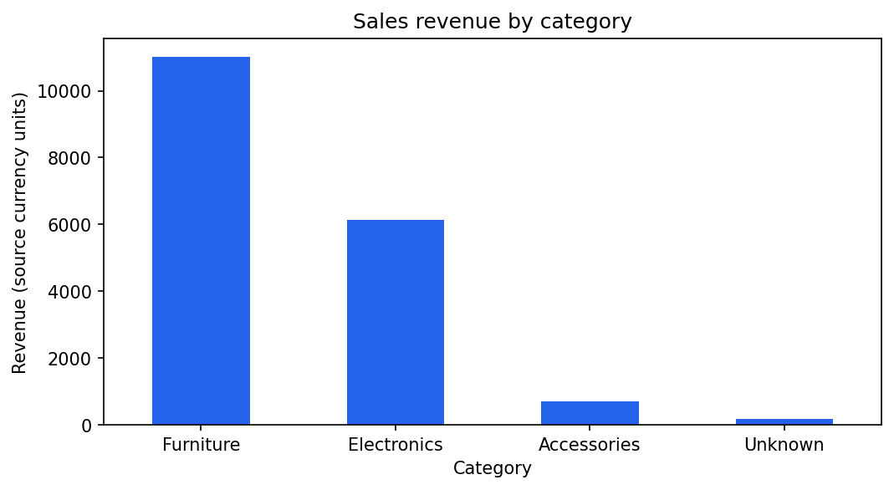

# Sales Analytics Pipeline

A reproducible Python pipeline that cleans messy sales data, joins customer information, and produces business reports with pandas.

Built from my completed **HackYourFuture Data Track Weeks 4 and 5** work: the sales analysis from Week 4 and the containerization, tests, and CI continuation from Week 5. This portfolio version provides a local sample run, consistent configuration, and checks for common reporting errors. [Source history and credits](docs/provenance.md).

## What it demonstrates

- Cleaning inconsistent strings, dates, prices, quantities, and duplicate transaction IDs.
- Joining sales to customer records while preventing duplicate customer keys from inflating totals.
- Reporting weekly revenue, customer spending, category performance, and loyalty metrics.
- Writing CSV and Parquet outputs and a chart, with automated checks and a Docker image.
- Keeping Azure transfers optional so the sample runs without cloud credentials.

```text
Sales CSV + customer CSV
    → normalize and validate usable sales
    → join customers by normalized email
    → calculate revenue and aggregate reports
    → CSV + Parquet + category revenue chart
```

## Sample results

The included HYF teaching dataset contains **122 sales rows** and **37 customer rows**. The local run retains **102 cleaned transactions**, of which **98 match customers**. Their combined revenue is **18,017.22 source currency units**; the input does not specify a currency.

| Category | Revenue | Transactions |
|---|---:|---:|
| Furniture | 11,012.71 | 42 |
| Electronics | 6,136.15 | 39 |
| Accessories | 703.43 | 13 |
| Unknown | 164.93 | 4 |



These results are generated from the included sample, not live business data. [Saved sample reports](reports/sample/) let you inspect the output before running the project.

## Run locally

Use Python **3.11–3.13** and `uv`. From the repository root:

```bash
uv sync --frozen
uv run python -m src.pipeline
```

The default run reads `data/sample/` and writes to `reports/generated/`. It requires no account, API key, Azure login, or environment file.

| Output | Grain and metric |
|---|---|
| `weekly_revenue.csv` | ISO year + ISO week + region; revenue and transaction count |
| `customer_summary.parquet` | Customer email; total spending, mean transaction revenue, and transaction count |
| `category_performance.csv` | Category; revenue and transaction count |
| `loyalty_analysis.csv` | Loyalty tier; mean transaction revenue (`avg_spent`) and distinct purchasing customers |
| `category_revenue.png` | Revenue totals by category |

Revenue is `price × quantity`. A source transaction row is counted as one order; this dataset does not define multi-line baskets. Customer summaries include customers with matched purchases, rather than every customer in the input table.

### Your own CSVs

Put `messy_sales.csv` and `messy_customers.csv` in a folder of your choice. Copy `.env.example` to `.env`, then set `DATA_DIR` and, optionally, `OUTPUT_DIR`. Load it explicitly:

```bash
uv run --env-file .env python -m src.pipeline
```

| Input | Columns |
|---|---|
| Sales | `transaction_id`, `product_name`, `category`, `price`, `quantity`, `customer_email`, `date` |
| Customers | `customer_email`, `customer_name`, `region`, `loyalty_tier` |

Dates use `YYYY-MM-DD`. The supplied customer fixture also contains `signup_date`, which is not used in these reports.

## Cleaning and join rules

1. Trim and title-case product names; trim and lowercase customer emails.
2. Convert prices and quantities to numbers and dates to timestamps.
3. Remove missing/blank products, invalid or negative prices, invalid/non-positive quantities, invalid dates, missing transaction IDs, and missing/blank sales emails. Negative quantities are excluded, so this pipeline does not model returns.
4. Keep the first valid row for each transaction ID. Missing categories become `Unknown`, preserving those rows in category totals.
5. Normalize customer keys and use an inner join. Unmatched sales are excluded from reports. Duplicate normalized customer emails cause the run to fail rather than multiplying sales rows. Missing customer region or loyalty tier becomes `Unknown`.
6. Mark matched transactions worth at least 150 as `is_high_value`. Weekly summaries include the ISO year to keep different years separate.

A run with no matched transactions fails before writing reports. Report files are overwritten on each successful run; this is a batch report pipeline, not an append-only transaction archive. The four summaries use the same matched sales population, and tests verify their revenue totals agree. Monetary calculations currently use floating-point values, which is appropriate for this teaching analysis but requires a deliberate precision policy for accounting use.

## Docker

```bash
docker build -t sales-analytics-pipeline:local .
docker run --rm sales-analytics-pipeline:local
```

The image includes the sample inputs. To keep outputs on your computer, mount a destination folder. In PowerShell:

```powershell
New-Item -ItemType Directory -Force reports/generated | Out-Null
docker run --rm -v "${PWD}/reports/generated:/app/reports/generated" sales-analytics-pipeline:local
```

## Tests and CI

```bash
uv run ruff check src tests
uv run ruff format --check src tests
uv run pytest -q
```

Tests cover cleaning, invalid configuration, duplicate customer keys, unmatched sales, ISO week/year boundaries, revenue reconciliation, empty results, and a repeatable sample run with network access blocked. Optional Azure transfers are not integration-tested against a live account.

The [CI workflow](.github/workflows/ci.yml) runs checks and the sample pipeline, then builds and runs the Docker image and saves the generated reports as an artifact. It needs no Azure secrets and does not deploy cloud resources.

## Optional Azure transfers

Install the Azure extra:

```bash
uv sync --frozen --extra azure
```

Use an Azure account and containers you are authorized to access. Transfers use `DefaultAzureCredential`; local development can use an existing Azure CLI login. Set these values in `.env` as needed:

| Setting | Use |
|---|---|
| `INPUT_SOURCE=azure` | Download the two named CSV inputs before analysis |
| `AZURE_STORAGE_ACCOUNT_URL` | Your account's Blob endpoint |
| `AZURE_INPUT_CONTAINER` | Existing container containing the two input CSVs |
| `DATA_DIR=data/downloaded` | Destination for downloaded files |
| `UPLOAD_TO_AZURE=true` | Upload the report files after writing locally |
| `AZURE_OUTPUT_CONTAINER` | Existing destination container |

Run with `uv run --env-file .env python -m src.pipeline`. Uploads overwrite files with the same names. The customer Parquet file is downloaded again and compared with the local DataFrame. Local files remain if an upload fails; transfers across multiple files are not atomic. The default container image contains only the local dependencies; cloud use requires an image built with the Azure extra and an authorized runtime identity.

## Project structure

```text
src/                 cleaning, customer join, reports, runner, optional Azure transfers
tests/               regression and offline end-to-end checks
data/sample/         original HYF teaching CSV inputs
reports/sample/      saved output from the included inputs
reports/generated/   local runtime output (ignored by Git)
docs/provenance.md   source branches, commits, and changes in this portfolio version
Dockerfile           runnable sample container
pyproject.toml       dependencies and check configuration
uv.lock              resolved dependency versions
```
